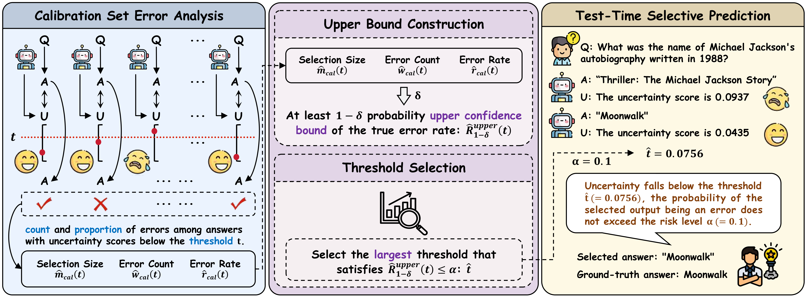
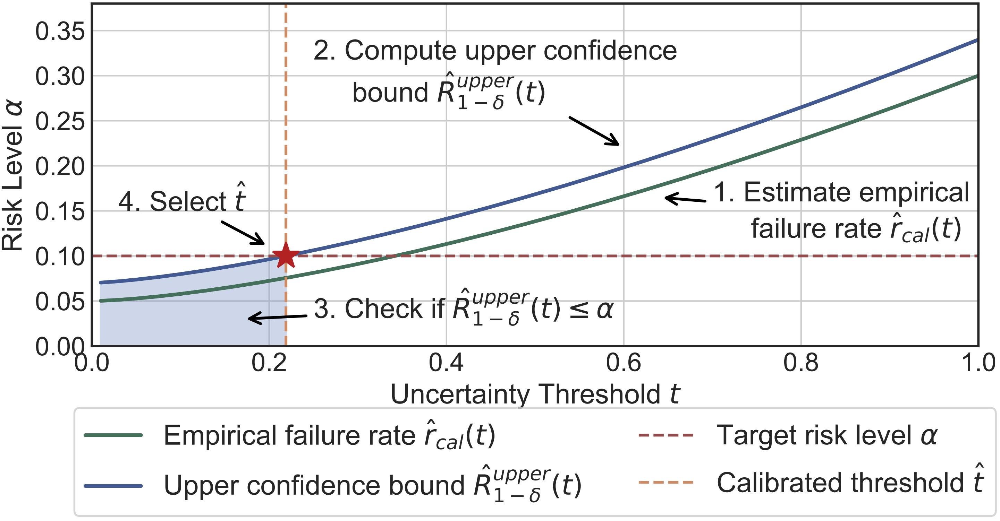

# [AAAI 2026] COIN: Uncertainty-Guarding Selective Question Answering for Foundation Models with Provable Risk Guarantees
- **Authors:** Zhiyuan Wang, Jinhao Duan, Qingni Wang, Xiaofeng Zhu, Tianlong Chen, Xiaoshuang Shi*, Kaidi Xu*
- [**arXiv**](https://arxiv.org/abs/2506.20178)


- **Step 1:** *Given an initialized threshold t, we perform selective prediction on the calibration set and estimate the empirical false discovery rate (FDR).*
- **Step 2:** *Establish the (1-&delta;) upper confidence bound of the system risk.*
- **Step 3:** *Adjust the threshold t such that the bound does not exceed &alpha;, and select the largest t to filter out samples at test time.*




### Data Preparing
```shell
python parse_commonsense_qa.py --cache-model LocalPath --generate-model ModelVersion --few-shot-num InstanceNumber --max-num SampleNumber 
python parse_triviaqa.py --cache-model LocalPath --generate-model ModelVersion --few-shot-num InstanceNumber --max-num SampleNumber 
```
- LocalPath: Local path for saving downloaded models
- ModelVersion: Model version, such as DeepSeek-R1-Distill-Qwen-7B
- InstanceNumber: We add several QA examples into the prompt, InstanceNumber is the number of applied QA pairs, such as 3
- SampleNumber: Number of parsed QA samples, totally employed for calibration and test, such as 6000

### Generation and Clean
```shell
python generate.py `--cache-model LocalPath --generate-model ModelVersion --dataset commonsenseqa` --max-length-of-generation 128 --num-beams 5 --num-generations-per-prompt 20 --top-p 0.9 --temperature 1.0
python generate.py --cache-model LocalPath --generate-model ModelVersion --dataset triviaqa --max-length-of-generation 128 --num-beams 5 --num-generations-per-prompt 10 --top-p 0.9 --temperature 1.0 
python clean_mcqa.py --cache-model LocalPath --generate-model ModelVersion --dataset commonsenseqa --max-length-of-generation 128 --num-beams 5 --num-generations-per-prompt 20 --top-p 0.9 --temperature 1.0
python clean_open_domain_qa.py --cache-model LocalPath --generate-model ModelVersion --dataset triviaqa --max-length-of-generation 128 --num-beams 5 --num-generations-per-prompt 10 --top-p 0.9 --temperature 1.0 
```

### Preparing for Correctness and Uncertainty
```shell
python get_mcqa_logit.py --cache-model LocalPath --generate-model ModelVersion --dataset commonsenseqa
python get_open_domain_qa_logits.py --cache-model LocalPath --generate-model ModelVersion --dataset triviaqa --max-length-of-generation 128 --num-beams 5 --num-generations-per-prompt 10 --top-p 0.9 --temperature 1.0 
```
